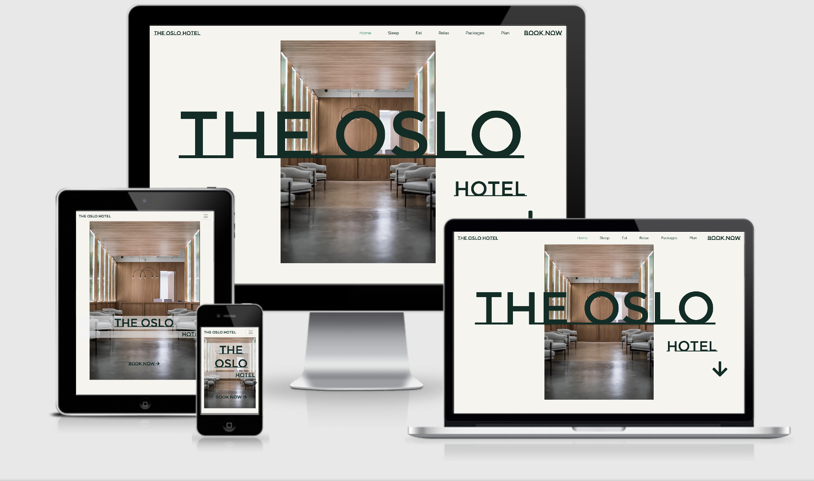

# The Oslo Hotel Website
## Milestone Project 1

- The aim of this project is to create a static front end site of at least 3 pages or sections using the technologies I have learned so far such as, HTML, Css, and optional Bootstrap or other libraries. The aim of the site is to present useful information in an ordered way to a set of users.
- I have decided to created a website for a fictional hotel. I have utilised all the elements I have learned in the previous modules to create this page and used principals of good user experience to create a responsive, well designed functional website.
- My site consists of a landing page to introduce the hotel and the section pages. The site then has 3 pages, one for the hotel guest rooms, one for the hotel food and bar options, and the final for the spa and leisure options. There is also a booking form section for potential guest to fill out to book rooms.

## Live project

- [View the live project here.](https://brianwhelandublin.github.io/milestone-project-1/)

## Screenshots

### Landing page screenshot

<h2 align="center"></h2>

### Section page screenshot

<h2 align="center"></h2>

### Booking-form screenshot

<h2 align="center"></h2>

- All screen shots created using [Am I responsive](http://ami.responsivedesign.is/)

# User experience

## User Stories

### Prospective guest

 - As a prospective hotel guest I would like to be able to see images of the hotel rooms and their prices.
 - As a prospective hotel guest I would like to see what food option there are at the hotel and their menus.
 - As a prospective hotel guest I would like to see what leisure activities there are at the hotel.
 - As a prospective hotel guest I would like to be able to book a room.
 - As a prospective hotel guest I would like to see if there are any packages for the hotel.

### Booked Guest

- As a booked guest I would like to see the hotel location and how to get there from the airport.
- As a booked guest I would like to see the hotel contact information.
- As a booked guest I would like to see what the rooms contain.

### Wire frames

- I created wire frames for the project using Balsamiq and have included a link here to access them in pdf form.

[View the wireframes in pdf here](wireframes/milestone-project-1-wireframes.pdf)

## Design 

### Colour Scheme 

- I used two main colours throughout this site, a stone colour #f5f4ef, and a dark green colour #052d26. I alternated the text and background colour between my two main colours to create defined sections when scrolling and to create a slight monochrome feel.
- I also used a light green colour #108f79 for my hover effect on the links to show the user that they element is a link.

### Typography 

- I wanted to create a strong look with my typography so i used a very graphic font Monsterrat Subrayada in large size for my headings, and Raleway for all other text.
- Both fonts where imported to my css stylesheet from [Google Fonts](https://fonts.google.com/).
- I used sans-serif as a fall-back font in case for any reason my fonts were not imported.

### Imagery 

- Imagery was very important to me and I choose images that conveyed the feel of the hotel I wanted to present and placed them throughout the site.
- Each section consists of a main title image that conveys to the user what the section is about. 
- I then placed images of the guest rooms, the restaurants and the spa and gym throughout the site so the user can see what the hotel is like.
- I used two sources for my images.
  - [Unsplash](https://unsplash.com/)
  - [Pexels](https://www.pexels.com/)
- I also placed video in each of the section pages with controls so the user can take a room tour, see some food being prepared for the resturant and see a treatment in the spa.
- All video was sourced from.
  - [Pexels](https://www.pexels.com/)

### Icons

- I used directional arrow icons from [Font Awsome](https://fontawesome.com/) to encourage users to scroll and to show links to a seperate section page.

## Features

### Current Features

 - Reponsive 
   - Through using mobile first design I have created a fully responsive wbsite on all screen sizes

 - Interactive 
   - Videos placed on each section page with controls so the user can choose to play it.
   - Google map iframe to show users the location of the hotel.
   - Drop down navbar on smaller devices.

- Social - Links to social media in the footer section.

- Booking - A booking form for users to book their stay.

- Informative - Packages section to show the user the packages and prices for their stay.

### Future Features

- Booking- In the future as I learn how to I would like to add a feature that thanks a customer for booking when they submit the form.

